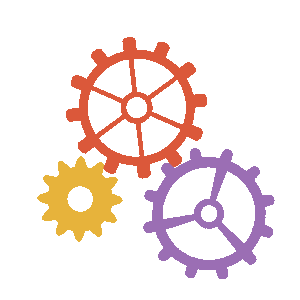
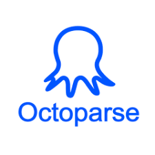
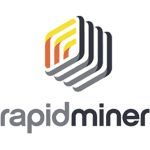
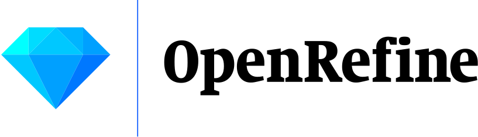
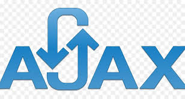
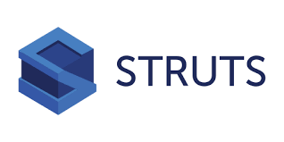
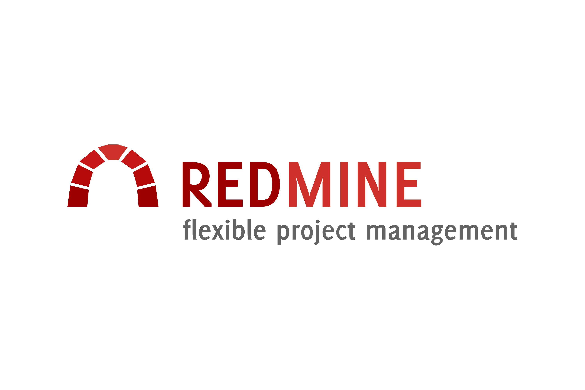
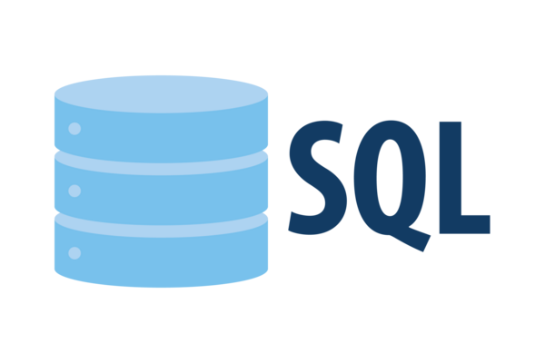

<div id="header" align="center">
  
  <h1>Hello  Welcome to My GitHub</h1>
</div>

<!-- --- -->

<h3 align="center">A versatile Computer Scientist from Malaysia 🇲🇾</h3><br>

<!-- TODO: -->
<ul>
    <li>
        💪 I’m currently intend to work on <b>Flutter Mobile App Development</b> and <b>Quality Assurance</b>
    </li>
    <!-- <li>
        📚 I’m currently interested to learn <a href="https://nestjs.com/">NestJS</a>
    </li> -->
    <li>
        💼 I'm currently open to new job opportunities
    </li>
    <li>
        📰 Read my publications at <a href="https://www.researchgate.net/profile/Derek-Gan-Kaa-Kheng">ResearchGate</a>
    </li>
    <li>
        📫 Reach me at  <a href="mailto:derekgan08@gmail.com">derekgan08@gmail.com</a>
    </li>
    <li>
        🌟 Don't forget to checkout my <a href="">portfolio</a> too~
    </li>
</ul>

## Introduction

I am a highly adaptable and versatile computer scientist with expertise across a broad range of domains in computer science, including Artificial Intelligence (AI), Data Science (DS), Software Engineering (SE), and Quality Assurance (QA). With a passion for problem-solving and continuous learning, I have developed a diverse skill set that allows me to tackle complex challenges in various fields of technology.

- AI & Machine Learning: Experienced in building intelligent systems, leveraging libraries such as TensorFlow, PyTorch, and Scikit-learn to design, implement, and deploy machine learning models.
- Data Science: Proficient in analyzing and visualizing data, using tools like Python, Pandas, and Matplotlib to derive meaningful insights and drive data-driven decision-making.
- Software Engineering: Strong foundation in software development, including desktop app, mobile app and web app. Experienced in building scalable and maintainable software solutions.
- Quality Assurance: Knowledgeable in software testing methodologies, with hands-on experience in writing test cases, automating tests, and ensuring software quality and reliability.

With a strong foundation in these key areas, I am committed to contributing to innovative projects and continuously expanding my expertise to stay at the forefront of technology.


## 🔭 My Vision
To be a versatile and innovative force in the world of technology, continuously expanding my expertise across the diverse domains of computer science. I aim to contribute to meaningful projects that solve complex challenges, push boundaries, and make a positive impact on society.

<!-- TODO: Make this quote as wide width banner with gif as background image 
https://quotescover.com/tools/online-quotes-maker
-->
<!-- ```python
Without goals and plans to reach your vision, you are like a ship that has set sail with no destination
``` -->

<h2>&nbsp My Mission</h2>
To embrace lifelong learning and adaptability by mastering key areas of computer science, including Artificial Intelligence (AI), Data Science (DS), Software Engineering (SE), and Quality Assurance (QA). Through hands-on problem-solving and collaboration, I strive to build scalable, reliable, and intelligent systems that drive innovation and create value for users and businesses alike.

## 📊 My GitHub Statistics
<div align="center">
    <!-- Source: https://github.com/anuraghazra/github-readme-stats -->
    <!-- <br>
    <br> -->
    <!-- Source: https://github.com/vn7n24fzkq/github-profile-summary-cards -->
    
    <div class="image-container" display="flex" justify-content="space-between">
        
        <br>
    </div>
    <br>
    <br>
    <!-- <br> -->
    <!-- <br>
    <br> -->
    <!-- Source: https://github.com/ryo-ma/github-profile-trophy -->
    <br>
</div>


##  Frameworks and Tools:

### Artificial Intelligence (AI):
<table border="1">
    <tr>
        <td><b>Machine Learning</td>
        <td>
            <a href="https://scikit-learn.org/"></a>&nbsp
        </td>
    </tr>
    <tr>
        <td><b>Deep Learning</td>
        <td>
            <a href="https://www.tensorflow.org/"> </a>&nbsp
            <a href="https://pytorch.org/"> </a>&nbsp
        </td>
    </tr>
    <tr>
        <td><b>Computer Vision</td>
        <td>
            <a href="https://opencv.org/"> </a>
        </td>
    </tr>
</table>

### Data Analytics and Business Intelligence Skills:
<table border="1">
    <tr>
        <td><b>Data Crawling</td>
        <td>
            <a href="https://github.com/strohne/Facepager"> </a>&nbsp
            <a href="https://www.octoparse.com/"> </a>
        </td>
    </tr>
    <tr>
        <td><b>Data Mining</td>
        <td>
            <a href="https://altair.com/altair-rapidminer"> </a>
        </td>
    </tr>
    <tr>
        <td><b>Data Cleaning and Data Preparation</td>
        <td>
            <a href="https://openrefine.org/"> </a>
        </td>
    </tr>
    <tr>
        <td><b>Statistical Analysis, Data Analysis and Data Exploration</td>
        <td>
            <a href="https://www.ibm.com/spss"> </a>&nbsp
            <a href="https://www.sas.com/en_my/home.html"> </a>
        </td>
    </tr>
    <tr>
        <td><b>Data Visualisation</td>
        <td>
            <a href="https://www.tableau.com/"> </a>
        </td>
    </tr>
    <tr>
        <td><b>Data Presentation</td>
        <td>
            <a href="https://www.microsoft.com/en-us/power-platform/products/power-bi"> </a>
        </td>
    </tr>
</table>

### Natural Language Processing:

<table border="1">
    <tr>
        <td><b>Text Mining</td>
        <td>
            <a href="https://www.laurenceanthony.net/software/antconc/"> </a>
        </td>
    </tr>
    <tr>
        <td><b>Semantic Retrieval</td>
        <td>
            <a href="https://www.tensorflow.org/"> </a>&nbsp
        </td>
    </tr>
</table>

### Prototyping/UI/UX Tools:
<div>
    <a href="https://www.figma.com/"> </a>&nbsp
    <a href="https://helpx.adobe.com/support/xd.html"> </a>&nbsp
    <a href="https://gluonhq.com/products/scene-builder/"> </a>
</div>

### SQL Database Development and Management:
<div>
    <a href="https://dbeaver.io/"> </a>&nbsp
    <a href="https://www.oracle.com/my/database/"> </a>&nbsp
    <a href="https://www.mysql.com/"> </a>&nbsp
    <a href="https://www.microsoft.com/en-my/sql-server/sql-server-downloads"> </a>&nbsp
    <a href="https://www.ibm.com/db2"> </a>
</div>

### NoSQL Database Development and Management:
<div>
    <a href="https://www.mongodb.com/"> </a>&nbsp
    <a href="https://firebase.google.com/"> </a>&nbsp
    <a href="https://aws.amazon.com/dynamodb/"> </a>&nbsp
    <a href="https://cassandra.apache.org/"> </a>&nbsp
    <a href="https://neo4j.com/"> </a>
</div>

### Big Data Technologies:
<div>
    <a href="https://hadoop.apache.org/"> </a>&nbsp
    <a href="https://spark.apache.org/"> </a>&nbsp
    <a href="https://hive.apache.org/"> </a>
</div>

### Website and Web Application Development:
<table border="1">
    <tr>
        <td><b>Frontend</td>
        <td>
            <a href="https://react.dev/"> </a>&nbsp
            <a href="https://vuejs.org/"> </a>&nbsp
            <a href="https://www.thymeleaf.org/"> </a>&nbsp
            <a href="https://jquery.com/"> </a>&nbsp
            <a href="https://api.jquery.com/jQuery.ajax/"> </a>
        </td>
    </tr>
    <tr>
        <td><b>Middleware</td>
        <td>
            <a href="https://expressjs.com/"> </a>&nbsp
            <a href="https://www.oracle.com/java/technologies/appmodel.html"> </a>&nbsp
            <a href="https://tomcat.apache.org/"> </a>&nbsp
            <a href="https://struts.apache.org/"> </a>
        </td>
    </tr>
    <tr>
        <td><b>Backend</td>
        <td>
            <a href="https://nodejs.org/"> </a>&nbsp
            <a href="https://flask.palletsprojects.com/"> </a>&nbsp
            <a href="https://spring.io/"> </a>&nbsp
            <a href="https://spring.io/projects/spring-boot"> </a>
        </td>
    </tr>
</table>

<!-- #### Frontend:
<div>
    <a href="https://react.dev/"> </a>&nbsp
    <a href="https://vuejs.org/"> </a>
</div>

#### Middleware:
<div>
    <a href="https://expressjs.com/"> </a>
</div>

#### Backend:
<div>
    <a href="https://nodejs.org/"> </a>&nbsp
    <a href="https://flask.palletsprojects.com/"> </a>&nbsp
    <a href="https://spring.io/"> </a>&nbsp
    <a href="https://spring.io/projects/spring-boot"> </a>
</div> -->

### Mobile Application Development:
<div>
    <a href="https://flutter.dev/"> </a>
</div>

### Desktop Application Development:
<div>
    <a href="https://openjfx.io/"> </a>&nbsp
    <a href="https://gluonhq.com/products/scene-builder/"> </a>
</div>

### Software Testing:
<div>
    <a href="https://www.selenium.dev/selenium-ide/"> </a>&nbsp
    <a href="https://www.postman.com/"> </a>&nbsp
    <a href="https://www.redmine.org/"> </a>
</div>

### Version Control:
<div>
    <a href="https://github.com/derekgan08"> </a>&nbsp
    <a href="https://gogs.io/"> </a>
</div>

##  Programming Languages
### Object-Oriented Programming Language (OOP):
<div>
    <a href="https://cplusplus.com/"> </a>&nbsp
    <a href="https://www.java.com/"> </a>&nbsp
    <a href="https://www.python.org/"> </a>
</div>

### Web Development:
<div>
    <a href="https://www.w3.org/html/"> </a>&nbsp
    <a href="https://www.w3.org/Style/CSS/Overview.en.html"> </a>&nbsp
    <a href="https://www.java.com/"> </a>&nbsp
    <a href="https://www.javascript.com/"> </a>&nbsp
    <a href="https://www.php.net/"> </a>&nbsp
    <a href="https://www.python.org/"> </a>
</div>

### Mobile App Development:
<div>
    <a href="https://dart.dev/"> </a>
</div>

### Desktop App Development:
<div>
    <a href="https://www.java.com/"> </a>
</div>

### Data Analysis:
<div>
    <a href="https://www.python.org/"> </a>&nbsp
    <a href="https://www.r-project.org/"> </a>&nbsp
    <a href="https://www.mathworks.com/products/matlab.html"> </a>
</div>

### Other Languages:
<div>
    <a href="https://www.cprogramming.com/"> </a>&nbsp
    <a href="https://dotnet.microsoft.com/en-us/languages/csharp"> </a>&nbsp
    <a href="https://go.dev/"> </a>&nbsp
    <a href="https://www.ruby-lang.org/en/"> </a>&nbsp
    <a href="https://www.oracle.com/my/database/technologies/appdev/sql.html"> </a>
</div>


<!-- <details> 
  <summary></summary>
   <i>Note: In case of any discrepancy between the information listed here and those on my resume, my resume shall take precedence.</i>
</details> -->

<!-- --- -->

##  My Coding Journey
**2019** - Started to learn my first programming language – Python<br>
**2020** - Enrolled in School of Computer Science at Universiti Sains Malaysia<br>
**2021** - Freelancing in Software Development and Software Testing<br>
**2022** - Majoring in Intelligent Computing, officially embark my AI journey<br>
**2023** - Full-Stack Development Intern at DynaFront Systems Malaysia<br>
**2024** - Won Silver Award in USM Computer Science Final Year Project @ PIXEL2024

*Note: In case of any discrepancy between the information listed in this overview and those on my resume, my resume shall take precedence.*

<!-- --- -->

##  Connect with Me
<!-- <h3 align="center">Connect with Me:</h3> -->
<div id="connect-with-me" align="center">
    <a href="https://github.com/derekgan08"  target="blank">
        
    </a> &nbsp
    <a href="https://www.kaggle.com/derekgan08" target="blank">
        
    </a> &nbsp
    <a href="https://www.linkedin.com/in/derekgan08/"  target="blank">
        
    </a> &nbsp
    <a href="https://www.researchgate.net/profile/Derek-Gan-Kaa-Kheng" target="blank">
        
    </a> &nbsp
</div>

<br><br>

<p align="right">
    <i>
        "In the ever-evolving world of computer science, the true joy lies not in mastering one path, but in exploring many. The ability to adapt, learn, and innovate across diverse fields makes every challenge a new opportunity to sprout and flourish." – Anonymous
    </i>
</p>